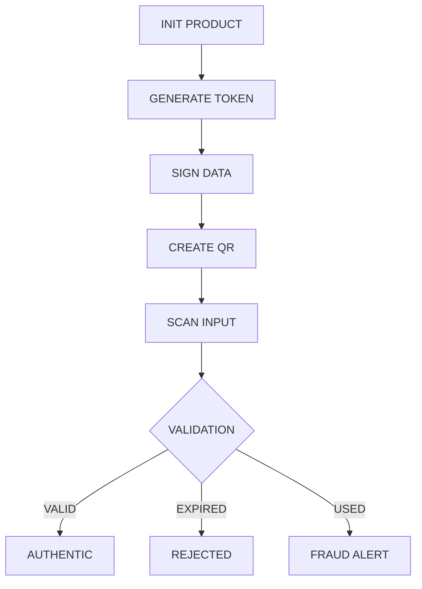

<!-- 🔥 VERIFAI DARK NEON README -->

<p align="center">
  
</p>

<p align="center">
  
  
  
</p>

---

# 🧬 VERIFAI // AUTHENTICATION PROTOCOL

SYSTEM PURPOSE:
```diff
+ Detect counterfeit products using one-time cryptographic QR validation
```

---

## ⚡ SYSTEM MODULES

### 🧿 QR GENERATION ENGINE
```bash
> Generate unique token
> Attach product metadata
> Inject signature hash
> Encode into QR payload
```

### 🔐 ONE-TIME VALIDATION CORE
```diff
+ FIRST SCAN      → AUTHENTIC ✅
- SECOND SCAN     → FRAUD ALERT 🚫
! EXPIRED TOKEN   → INVALID ⏰
```

> Each QR self-destructs after first verification

### 📡 PRODUCT REGISTRY (SIMULATED DB)
```bash
> Track lifecycle states
> ACTIVE | SCANNED | EXPIRED
> Real-time UI sync
```

### 🛰️ CONSUMER VERIFY TERMINAL
```bash
> Input Token ID
> Run validation checks:
    - existence
    - expiry
    - scan history
> Output trust signal
```

---

## 🧠 CORE ARCHITECTURE



---

## 🧰 TECH STACK

```bash
Frontend   :: HTML + CSS (Glass UI)
Core Logic :: Vanilla JavaScript
QR Engine  :: qrcode.js
Storage    :: In-memory object
Security   :: Simulated PKI signature
```

---

## 🚀 EXECUTION

```bash
git clone https://github.com/your-username/verifai.git
cd verifai
open verifai-prototype.html
```

---

## 🧪 SYSTEM LIMITATIONS

```diff
- No persistent backend
- Signature not cryptographically verified
- No camera-based QR scanning
```

---

## 🔮 NEXT EVOLUTION

```diff
+ Blockchain-backed registry
+ Real PKI encryption
+ Mobile scan integration
+ Cloud database
+ Fraud analytics engine
```

---

## 👤 AUTHOR NODE

```bash
Haraks Kaur Duggal
Harpreet Singh
```

---

<p align="center">
  
</p>
